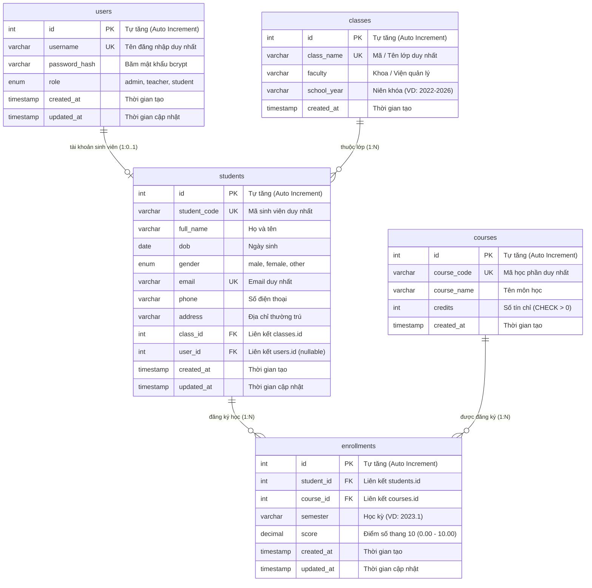

# Hệ Thống Quản Lý Sinh Viên (Student Management System)

Dự án website quản lý sinh viên full-stack dành cho portfolio cá nhân.  
**Tech stack:** React (Vite) + Node.js (Express) + MySQL.

---

## 1. Sơ đồ Thực thể Mối quan hệ (Mermaid ER Diagram)



---

## 2. Chi tiết Thiết kế Cơ sở dữ liệu

### Khóa chính & Khóa ngoại (Constraints & Relationships)
- **`students.class_id` -> `classes.id`**: `ON DELETE RESTRICT ON UPDATE CASCADE`  
  *Ý nghĩa:* Không cho phép xóa một lớp học nếu lớp đó đang có sinh viên trực thuộc (bảo vệ tính toàn vẹn dữ liệu).
- **`students.user_id` -> `users.id`**: `ON DELETE SET NULL ON UPDATE CASCADE`  
  *Ý nghĩa:* Cho phép sinh viên liên kết với tài khoản hệ thống (1-1 tùy chọn). Nếu tài khoản người dùng bị xóa, hồ sơ sinh viên vẫn được bảo lưu và trường `user_id` tự động gán `NULL`.
- **`enrollments.student_id` -> `students.id`**: `ON DELETE CASCADE ON UPDATE CASCADE`  
  *Ý nghĩa:* Khi xóa một sinh viên, toàn bộ lịch sử học tập/điểm số của sinh viên đó sẽ tự động được thu hồi.
- **`enrollments.course_id` -> `courses.id`**: `ON DELETE RESTRICT ON UPDATE CASCADE`  
  *Ý nghĩa:* Không thể xóa môn học nếu đã có sinh viên đăng ký môn đó.

### Ràng buộc duy nhất & Kiểm tra (Unique & Check Constraints)
- **UNIQUE**:
  - `users.username`
  - `classes.class_name`
  - `students.student_code`
  - `students.email`
  - `students.user_id` (đảm bảo 1 tài khoản chỉ gắn tối đa 1 hồ sơ sinh viên)
  - `courses.course_code`
  - Composite Unique: `enrollments(student_id, course_id, semester)` (ngăn chặn việc đăng ký trùng 1 môn trong cùng 1 học kỳ).
- **CHECK**:
  - `courses.credits > 0` (số tín chỉ phải là số nguyên dương).
  - `enrollments.score IS NULL OR (score >= 0.00 AND score <= 10.00)` (điểm số hợp lệ trong thang điểm 10).

### Chỉ mục tối ưu truy vấn (Indexes)
- `idx_users_role` trên `users(role)`: Tăng tốc truy vấn lọc danh sách theo vai trò.
- `idx_classes_faculty` trên `classes(faculty)`: Tăng tốc tìm kiếm lớp theo khoa.
- `idx_students_class_id` trên `students(class_id)`: Tối ưu phép kết bảng (JOIN) giữa sinh viên và lớp.
- `idx_students_full_name` trên `students(full_name)`: Tăng tốc độ tìm kiếm theo tên sinh viên.
- `idx_enrollments_student`, `idx_enrollments_course`, `idx_enrollments_semester`: Tối ưu báo cáo bảng điểm theo sinh viên, môn học hoặc từng học kỳ.

---

## 3. Hướng dẫn Khởi tạo & Import Database

### Cách 1: Sử dụng MySQL CLI (Terminal)
Mở PowerShell hoặc Command Prompt tại thư mục dự án và chạy:

```bash
# 1. Chạy file schema để tạo database qlsv_db và cấu trúc bảng
mysql -u root -p < backend/database/schema.sql

# 2. Chạy file seed để nạp dữ liệu mẫu
mysql -u root -p < backend/database/seed.sql
```

### Cách 2: Sử dụng DBeaver / HeidiSQL / MySQL Workbench / phpMyAdmin
1. Mở công cụ quản lý MySQL của bạn.
2. Mở file [schema.sql](file:///h:/Code/QLSV/backend/database/schema.sql) và thực thi (Execute SQL script).
3. Mở tiếp file [seed.sql](file:///h:/Code/QLSV/backend/database/seed.sql) và thực thi.

---

## 4. Danh sách Tài khoản & Dữ liệu mẫu (Seed Data)

Tất cả mật khẩu đã được mã hóa bằng thuật toán `bcrypt` với `salt rounds = 10`.

| Role | Username | Mật khẩu mẫu | Ghi chú |
| :--- | :--- | :--- | :--- |
| **Admin** | `admin` | `admin123` | Quản trị viên toàn quyền hệ thống |
| **Teacher** | `teacher_lan` | `teacher123` | Giảng viên |
| **Teacher** | `teacher_hung` | `teacher123` | Giảng viên |
| **Student** | `sv20220001` | `student123` | Đại diện sinh viên Nguyễn Văn An (Lớp CNTT1-K67) |
| **Student** | `sv20220002` -> `sv20220005` | `student123` | Các tài khoản sinh viên mẫu khác |

**Dữ liệu danh mục sẵn có:**
- **4 Lớp học:** `CNTT1-K67`, `CNTT2-K67`, `KTPM1-K67`, `KHMT1-K67`.
- **6 Môn học:** `INT1001` (Nhập môn C/C++), `INT1002` (CTDL&GT), `INT1003` (CSDL), `INT1004` (Web nâng cao), `INT1005` (Mạng máy tính), `INT1006` (Kiến trúc máy tính & HĐH).
- **20 Sinh viên mẫu:** Họ tên tiếng Việt đầy đủ, ngày sinh, email, SĐT, địa chỉ trải đều các lớp.
- **Bảng điểm mẫu:** Nhiều bản ghi điểm thi học kỳ `2023.1`, `2023.2` và môn đang học (`score = NULL`).

---

## 5. Danh sách API Authentication & Phân quyền (RBAC)

| Phương thức | Endpoint | Middleware bảo vệ | Chức năng |
| :--- | :--- | :--- | :--- |
| `POST` | `/api/auth/register` | `validateRegister` | Đăng ký tài khoản mới (mã hóa bcrypt, trả JWT) |
| `POST` | `/api/auth/login` | `validateLogin` | Đăng nhập (hỗ trợ cả username hoặc email) |
| `GET` | `/api/auth/me` | `verifyToken` | Lấy thông tin user hiện tại (kèm hồ sơ SV nếu có) |
| `GET` | `/api/auth/admin-teacher-only` | `verifyToken`, `authorizeRoles('admin', 'teacher')` | Route mẫu kiểm tra phân quyền RBAC |

---

## 6. Danh sách REST API Quản Lý Sinh Viên

| Phương thức | Endpoint | Middleware bảo vệ | Chức năng |
| :--- | :--- | :--- | :--- |
| `GET` | `/api/students` | `verifyToken` | Lấy danh sách SV (phân trang, search tên/mã, lọc lớp, sắp xếp) |
| `GET` | `/api/students/:id` | `verifyToken` | Xem chi tiết thông tin và bảng điểm của 1 sinh viên |
| `POST` | `/api/students` | `verifyToken`, `authorizeRoles('admin')`, `validateCreateStudent` | Thêm mới sinh viên (chống trùng mã SV, email) |
| `PUT` | `/api/students/:id` | `verifyToken`, `authorizeRoles('admin')`, `validateUpdateStudent` | Cập nhật thông tin sinh viên |
| `DELETE` | `/api/students/:id` | `verifyToken`, `authorizeRoles('admin')` | Xóa sinh viên khỏi hệ thống |

---

## 7. Danh sách REST API Quản Lý Lớp Học

| Phương thức | Endpoint | Middleware bảo vệ | Chức năng |
| :--- | :--- | :--- | :--- |
| `GET` | `/api/classes` | `verifyToken` | Lấy danh sách lớp (phân trang, search tên lớp, lọc khoa/niên khóa, kèm số SV) |
| `GET` | `/api/classes/:id` | `verifyToken` | Chi tiết 1 lớp học kèm số lượng sinh viên |
| `GET` | `/api/classes/:id/students` | `verifyToken` | Danh sách toàn bộ sinh viên đang theo học tại lớp |
| `POST` | `/api/classes` | `verifyToken`, `authorizeRoles('admin')`, `validateCreateClass` | Thêm mới lớp học (chống trùng tên lớp) |
| `PUT` | `/api/classes/:id` | `verifyToken`, `authorizeRoles('admin')`, `validateUpdateClass` | Cập nhật thông tin lớp học |
| `DELETE` | `/api/classes/:id` | `verifyToken`, `authorizeRoles('admin')` | Xóa lớp học (chặn xóa nếu lớp còn SV - trả 409) |

---

## 8. Danh sách REST API Quản Lý Môn Học

| Phương thức | Endpoint | Middleware bảo vệ | Chức năng |
| :--- | :--- | :--- | :--- |
| `GET` | `/api/courses` | `verifyToken` | Lấy danh sách môn học (phân trang, search mã/tên môn, kèm số lượt ĐK) |
| `GET` | `/api/courses/:id` | `verifyToken` | Chi tiết 1 môn học |
| `POST` | `/api/courses` | `verifyToken`, `authorizeRoles('admin')`, `validateCreateCourse` | Thêm mới môn học (chặn trùng mã môn, validate credits 1-6) |
| `PUT` | `/api/courses/:id` | `verifyToken`, `authorizeRoles('admin')`, `validateUpdateCourse` | Cập nhật thông tin môn học |
| `DELETE` | `/api/courses/:id` | `verifyToken`, `authorizeRoles('admin')` | Xóa môn học (chặn xóa nếu đã có điểm/đăng ký - trả 409) |

---

## 9. Danh sách REST API Quản Lý Điểm Số & Bảng Điểm (Grades)

| Phương thức | Endpoint | Middleware bảo vệ | Chức năng |
| :--- | :--- | :--- | :--- |
| `GET` | `/api/grades` | `verifyToken` | Lấy danh sách điểm (lọc SV, môn, học kỳ; phân trang. Student chỉ xem điểm của mình) |
| `GET` | `/api/students/:id/grades` | `verifyToken` | Bảng điểm chi tiết 1 SV kèm tính GPA thang 10 & 4 (chặn SV xem điểm người khác - 403) |
| `POST` | `/api/grades` | `verifyToken`, `authorizeRoles('admin', 'teacher')`, `validateCreateGrade` | Nhập điểm học phần (kiểm tra SV/môn tồn tại, chặn trùng kỳ - 409) |
| `PUT` | `/api/grades/:id` | `verifyToken`, `authorizeRoles('admin', 'teacher')`, `validateUpdateGrade` | Cập nhật điểm số học phần |
| `DELETE` | `/api/grades/:id` | `verifyToken`, `authorizeRoles('admin', 'teacher')` | Xóa bản ghi điểm |

> 📖 **Xem tài liệu chi tiết:** Vui lòng xem file [docs/API.md](file:///h:/Code/QLSV/docs/API.md) để biết cấu trúc Request body, Query params, Response mẫu và cURL cho từng endpoint.

---

## 10. Cấu trúc & Chạy ứng dụng Frontend (React + Vite)

### Cấu trúc thư mục `/frontend`
```text
frontend/
├── src/
│   ├── components/
│   │   ├── layout/
│   │   │   ├── Header.jsx       # Thanh điều hướng trên cùng, thông tin user, nút đăng xuất
│   │   │   ├── Sidebar.jsx      # Menu bên hông, active link, badge vai trò
│   │   │   └── AppLayout.jsx    # Khung layout chuẩn kết hợp Sidebar + Header + Outlet
│   │   └── ProtectedRoute.jsx   # Chặn truy cập nếu chưa login hoặc không đúng role
│   ├── context/
│   │   └── AuthContext.jsx      # Quản lý trạng thái login, user profile, lưu JWT vào localStorage
│   ├── pages/
│   │   ├── Login.jsx            # Trang đăng nhập kèm nút test tài khoản mẫu nhanh
│   │   ├── Dashboard.jsx        # Bảng điều khiển, thống kê số liệu sinh viên, lớp, môn học
│   │   ├── StudentList.jsx      # Danh sách sinh viên, tìm kiếm, lọc theo lớp, xem bảng điểm
│   │   └── Unauthorized.jsx     # Trang 403 Forbidden
│   ├── services/
│   │   └── api.js               # Axios instance tự động gán Bearer Token và xử lý 401
│   ├── styles/
│   │   └── index.css            # Hệ thống CSS hiện đại (Variables, Glassmorphism, Responsive)
│   ├── App.jsx                  # Cấu hình React Router DOM
│   └── main.jsx
├── .env.example
├── .env                         # VITE_API_BASE_URL=http://localhost:5000/api
└── package.json
```

### Cách chạy đồng thời Backend và Frontend
- **Backend:** `cd backend && npm run dev` (chạy trên cổng `5000`)
- **Frontend:** `cd frontend && npm run dev` (chạy trên cổng `5173`)
- **Truy cập:** Mở trình duyệt tại [http://localhost:5173/](http://localhost:5173/)


